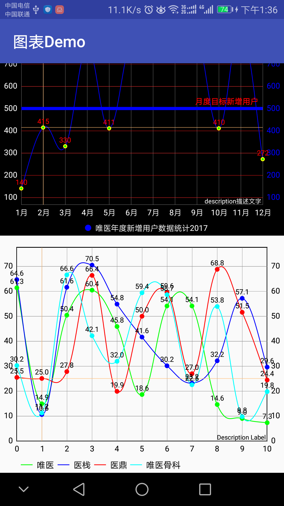
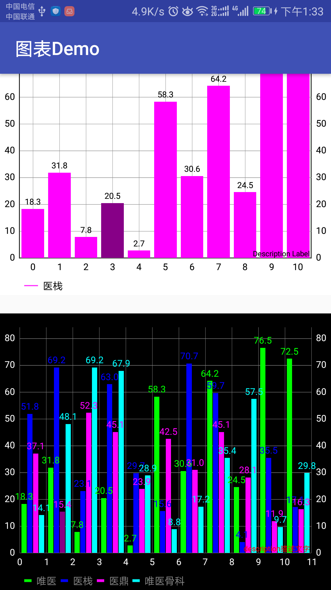
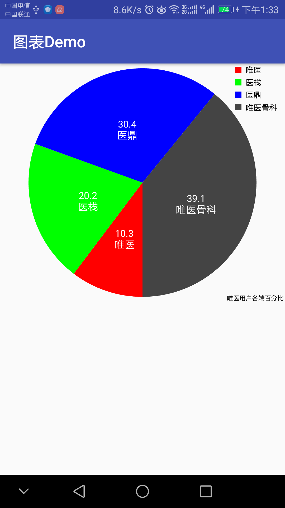
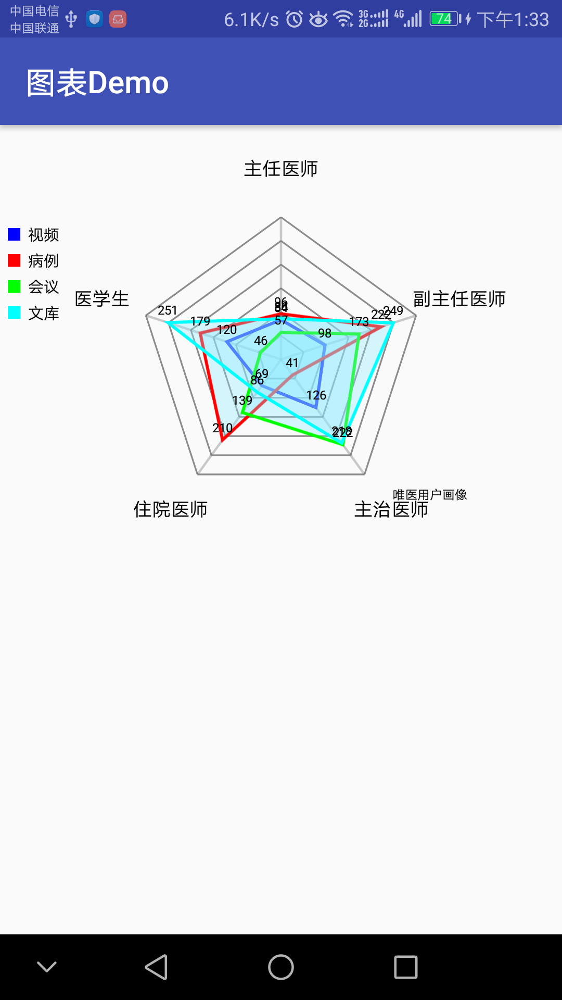

# ChartDemo
可以绘制折线图、柱状图、扇形图、网状图的单/多数据图形：单线、多线、单柱、多柱 等

## 添加依赖
```
implementation 'com.github.PhilJay:MPAndroidChart:v3.0.3'

```
## 管理类
- LineChartManager 线形图管理类
- BarChartManager 柱形图管理类
- PieChartManager 饼状图管理类
- RadarChartManager 雷达图管理类

## 使用

```
    @Override
    protected void onCreate(Bundle savedInstanceState) {
        super.onCreate(savedInstanceState);
        setContentView(R.layout.acitivity_line);
        //单线
        LineChart mLineChartSingle = findViewById(R.id.lineChart);

        //获取示例
        Legend legend = mLineChartSingle.getLegend();
        //是否隐藏示例
//        legend.setEnabled(false);
        //设置示例文字颜色
        legend.setTextColor(Color.WHITE);
        //设置示例图片类型
        legend.setForm(Legend.LegendForm.CIRCLE);
        //设置示例垂直显示位置，默认BOTTOM, 还有居中CENTER,顶部TOP
        legend.setVerticalAlignment(Legend.LegendVerticalAlignment.BOTTOM);
        //设置示例水平显示位置，默认LEFT, 还有居中CENTER,居右RIGHT
        legend.setHorizontalAlignment(Legend.LegendHorizontalAlignment.CENTER);
        //设置示例展示方向默认水平HORIZONTAL
        legend.setOrientation(Legend.LegendOrientation.HORIZONTAL);

        //显示边界线,默认不显示
        mLineChartSingle.setDrawBorders(false);
        //设置整个图表背景色
        mLineChartSingle.setBackgroundColor(Color.BLACK);
        //是否绘制网格背景
        mLineChartSingle.setDrawGridBackground(true);
        //设置网格背景色
        mLineChartSingle.setGridBackgroundColor(Color.TRANSPARENT);
        //设置X轴是否可缩放,默认可缩放
        mLineChartSingle.setScaleXEnabled(true);
        //设置Y轴是否可缩放,默认可缩放
        mLineChartSingle.setScaleYEnabled(true);
        //设置图表右下角描述
        Description description = new Description();
        description.setText("description描述文字");
        description.setTextColor(Color.WHITE);
        mLineChartSingle.setDescription(description);


        //获取X轴
        XAxis xAxis = mLineChartSingle.getXAxis();
        //设置X轴底部显示
        xAxis.setPosition(XAxis.XAxisPosition.BOTTOM);
        //设置X轴坐标之间的最小间隔
        xAxis.setGranularity(1);
        //设置X轴的刻度数量,第二个参数表示是否平均分配
        xAxis.setLabelCount(12,true);
        //设置X轴字体颜色
        xAxis.setTextColor(Color.WHITE);
        //设置X轴的值（最小值、最大值、然后会根据设置的刻度数量自动分配刻度显示）
//        xAxis.setAxisMinimum(0f);
//        xAxis.setAxisMaximum(20f);
        final ArrayList<String> mList = new ArrayList<>();
        for (int i = 0; i < 12; i++) {
            mList.add(i+1+"月");
        }
        xAxis.setValueFormatter(new IAxisValueFormatter() {
            @Override
            public String getFormattedValue(float value, AxisBase axis) {
                return mList.get((int) value);
            }
        });


        //获取右侧Y轴
        YAxis axisRight = mLineChartSingle.getAxisRight();
        //右侧Y轴是否显示
        axisRight.setEnabled(true);
        axisRight.setTextColor(Color.BLUE); //文字颜色
        axisRight.setGridColor(Color.RED); //网格线颜色
        axisRight.setAxisLineColor(Color.GREEN); //Y轴颜色

        //获取左侧Y轴
        YAxis axisLeft = mLineChartSingle.getAxisLeft();
        //设置左侧Y轴的颜色
        axisLeft.setTextColor(Color.WHITE);

        //限制线
        LimitLine limitLine = new LimitLine(500,"月度目标新增用户");
        limitLine.setLineWidth(4f); //宽度
        limitLine.setTextSize(10f);
        limitLine.setTextColor(Color.RED);  //颜色
        limitLine.setLineColor(Color.BLUE);
        axisRight.addLimitLine(limitLine); //Y轴添加限制线


        //设置数据
        List<Entry> entries = new ArrayList<>();
        for (int i = 0; i < 12; i++) {
            entries.add(new Entry(i, (float) (Math.random()) * 1000));
        }
        //一个LineDataSet就是一条线
        LineDataSet lineDataSet = new LineDataSet(entries, "唯医年度新增用户数据统计2017");
        //设置曲线值的圆点是实心还是空心,true:是空心
        lineDataSet.setDrawCircleHole(true);
        //设置显示值的字体大小
        lineDataSet.setValueTextSize(9f);
        //线模式为圆滑曲线（默认折线LINEAR）,CUBIC_BEZIER圆滑曲线，STEPPED垂直折线，HORIZONTAL_BEZIER也是圆滑曲线
        lineDataSet.setMode(LineDataSet.Mode.CUBIC_BEZIER);
        //设置线的颜色,同时也设置了legend示例的图片颜色了
        lineDataSet.setColor(Color.BLUE);
        //设置节点的颜色
        lineDataSet.setCircleColor(Color.YELLOW);
        //设置曲线节点空心的颜色
        lineDataSet.setCircleColorHole(Color.GREEN);
        //设置线上节点文字的颜色
        lineDataSet.setValueTextColor(Color.RED);
        LineData data = new LineData(lineDataSet);
        mLineChartSingle.setData(data);


        //多线图
        LineChart lineChartMulity = findViewById(R.id.lineChartMulity);
        setLineChartMultyData(lineChartMulity);

    }

    /**
     * 设置多线图
     * @param lineChartMulity
     */
    private void setLineChartMultyData(LineChart lineChartMulity) {
        LineChartManager lineChartManager = new LineChartManager(lineChartMulity);
        //List<Float> xAxisValues, List<List<Float>> yAxisValues, List<String> labels, List<Integer> colours
        //设置x轴的数据
        ArrayList<Float> xValues = new ArrayList<>();
        for (int i = 0; i <= 10; i++) {
            xValues.add((float) i);
        }

        //设置y轴的数据()
        List<List<Float>> yValues = new ArrayList<>();
        for (int i = 0; i < 4; i++) {
            List<Float> yValue = new ArrayList<>();
            for (int j = 0; j <= 10; j++) {
                yValue.add((float) (Math.random() * 80));
            }
            yValues.add(yValue);
        }

        //颜色集合
        List<Integer> colours = new ArrayList<>();
        colours.add(Color.GREEN);
        colours.add(Color.BLUE);
        colours.add(Color.RED);
        colours.add(Color.CYAN);

        //线的名字集合
        List<String> names = new ArrayList<>();
        names.add("唯医");
        names.add("医栈");
        names.add("医鼎");
        names.add("唯医骨科");
        lineChartManager.showLineChart(xValues,yValues,names,colours);
    }
```

特别鸣谢：[MPAndroidChart](https://github.com/PhilJay/MPAndroidChart)

- 

- 



